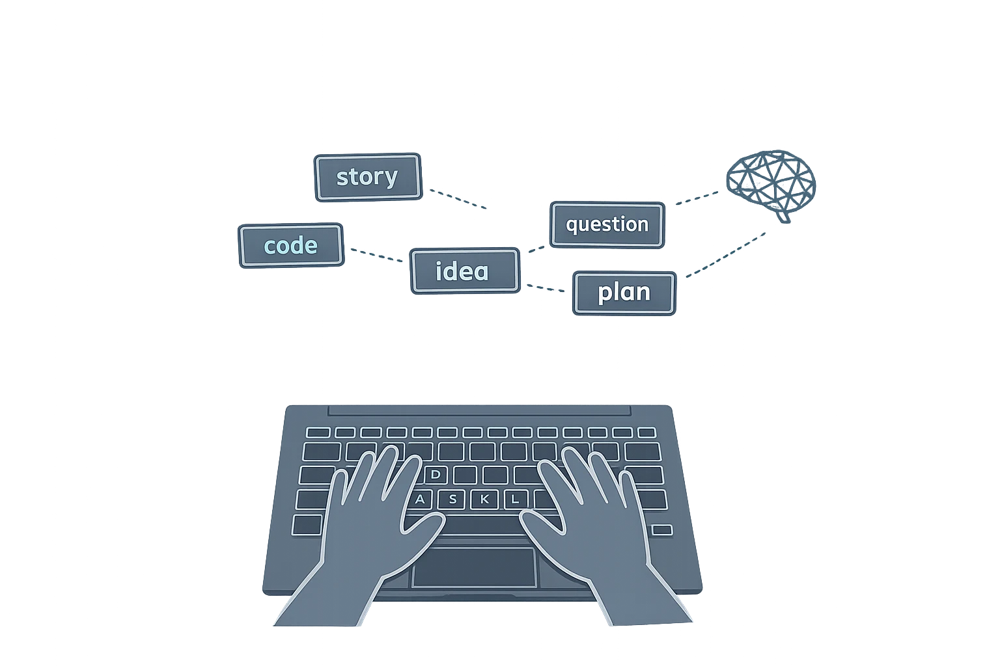
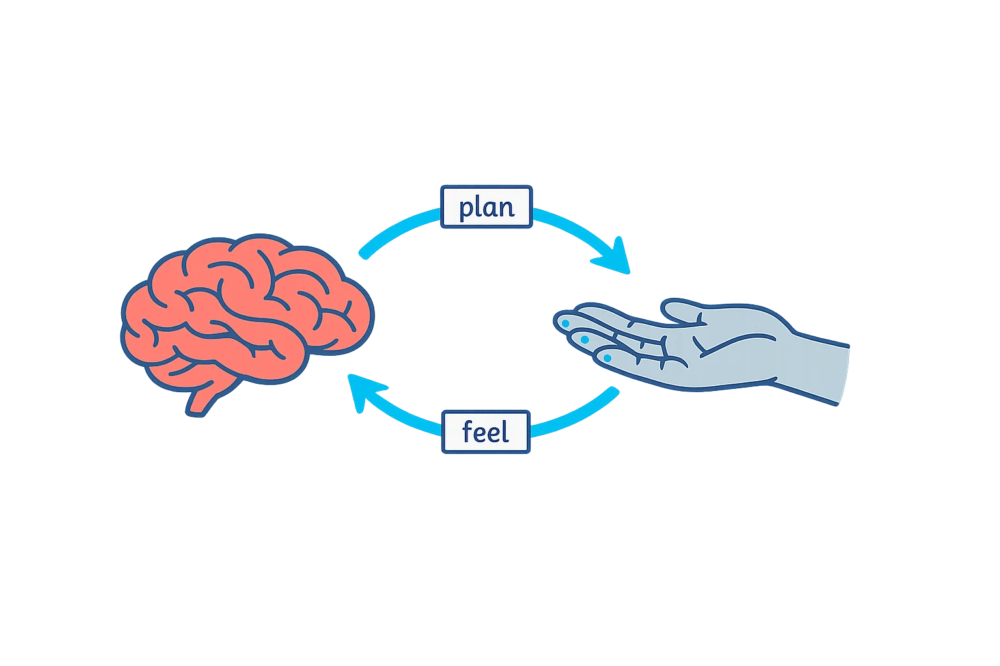
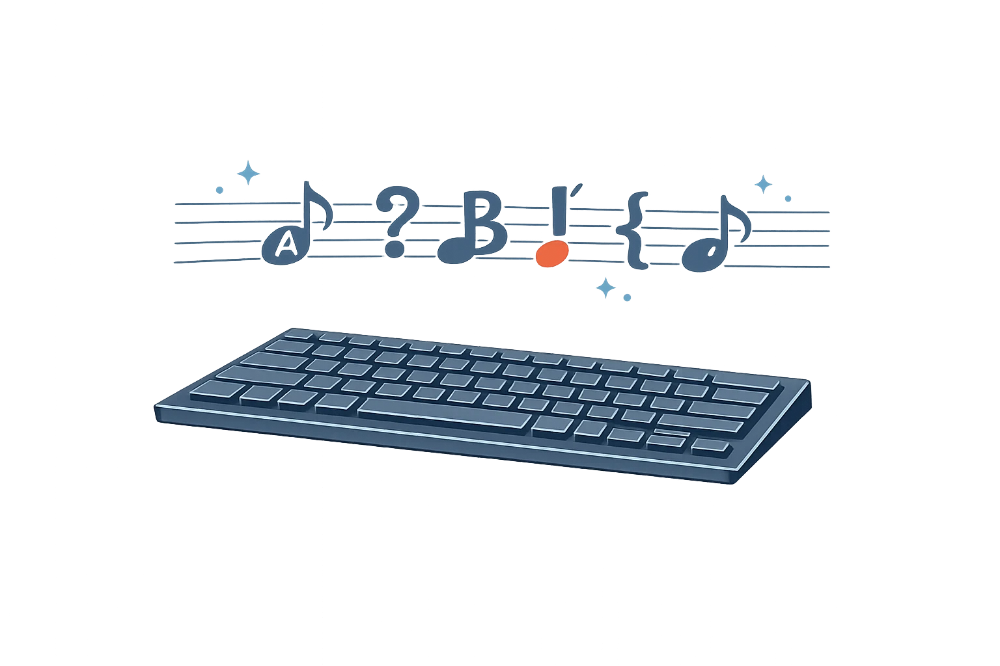
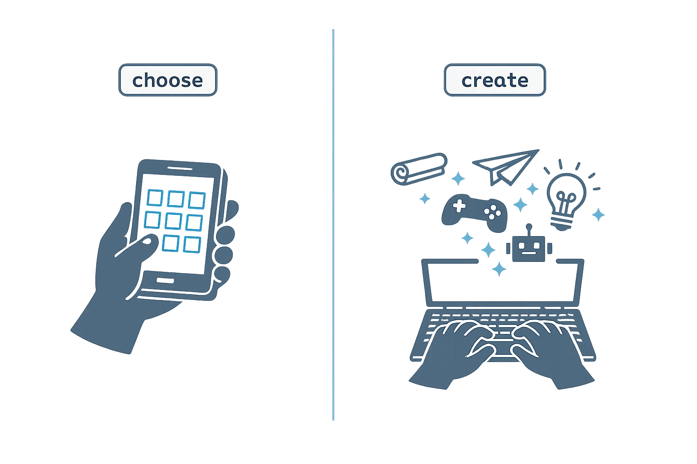
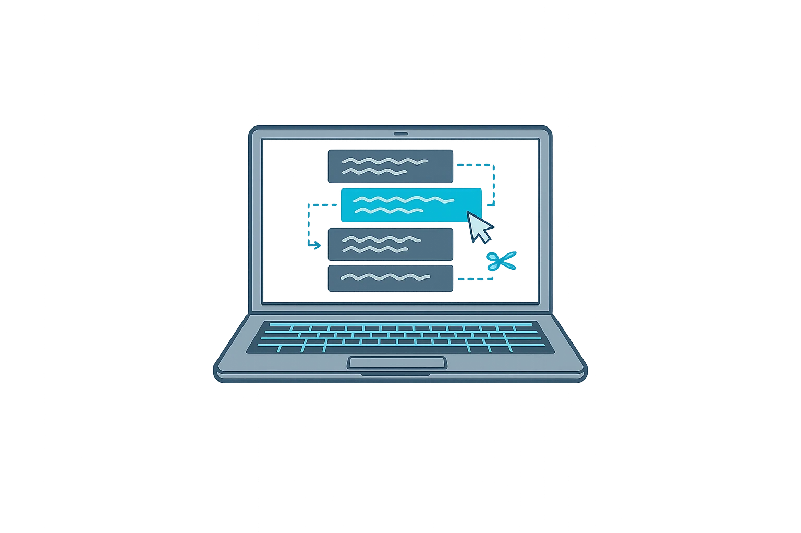
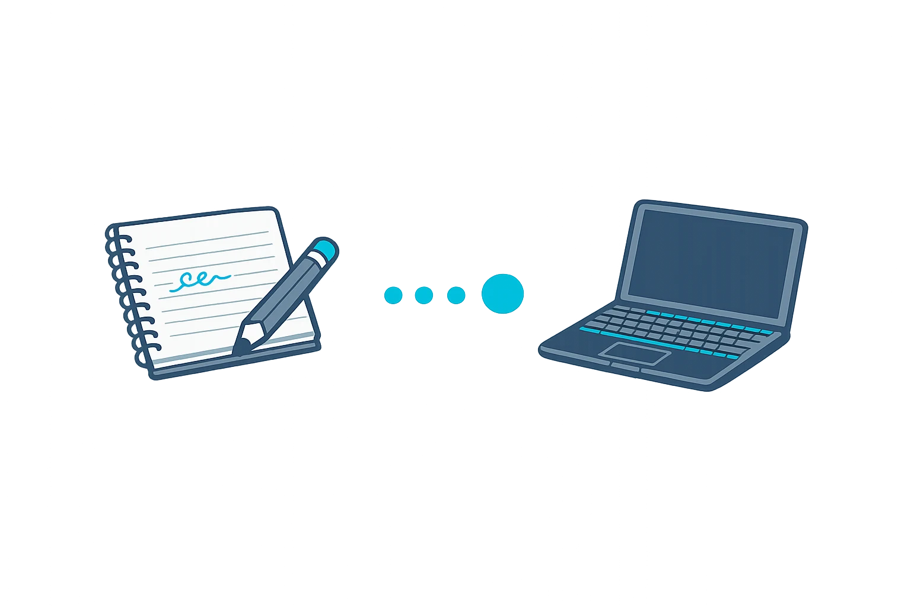

# The Superpower at Your Fingertips

*Why typing, handwriting, and deft hands help your brain grow*

Put your hand in front of your face and wiggle your fingers.

It looks ordinary, almost boring. A thumb. Four fingers. Some knuckles. A few lines on the skin. But that small moving thing at the end of your arm is one of the reasons humans could build houses, draw maps, sew clothes, write books, play music, repair machines, and now talk to computers.

Your hand is not just a tool that obeys your brain. It is also a teacher for your brain.

When you pick up a pencil, stack blocks, tie a knot, play piano, fold paper, type a sentence, or fix a tiny screw, your fingers are doing more than “moving.” They are testing the world. Your brain gives a command. Your fingers try it. Your skin and muscles report back what happened. Your brain adjusts and tries again. This loop is so fast you usually do not notice it.

That is why deft hands matter. “Deft” means skillful, quick, and careful. A deft hand is not just a fast hand. It is a hand that can do the right small movement at exactly the right time.

Scientists have a strange picture called the **homunculus** — a “little person” drawn according to how much brain space each body part uses. Imagine a cartoon person whose hands and mouth are huge and whose back is tiny. That is roughly what the homunculus looks like. The reason is not that your hands are physically huge. It is that hands do difficult, precise jobs, so the brain spends a lot of attention on them. Movement and feeling are always talking to each other in the brain: every small motion changes what you feel, and what you feel changes the next motion.[1][2]

This is why children naturally learn with their hands. Very young children poke, stack, squeeze, drop, tear, scribble, twist, and build. Adults sometimes see this as “mess.” The brain sees it as information.

A child who cuts paper is learning more than scissors. A child who builds with blocks is learning balance and space. These are all **fine motor skills**: small, careful movements that need muscles, joints, nerves, feeling, planning, and attention all working together.[3]

There is an important warning here: practicing finger skills does not magically make anyone a genius. The brain is not that simple. But careful hand work is closely tied to learning, because it trains attention, sequencing, feedback, and control. A 2024 review of studies on school-aged children found positive links between fine motor skills and several school subjects — math, reading, writing, spelling, and language — while also noting that scientists still need more research to understand exactly how these links work.[4]

So the honest lesson is not “good fingers equal smart brain.” The honest lesson is better:

When your hands become more skillful, they can remove friction between your mind and the world.

## The moment the keyboard disappears

At first, typing is annoying.

You want to write *dragon*, but your eyes are searching for the letter **D**. You find **D**, then you lose **R**. You press the wrong key. You backspace. You forget what the dragon was doing. By the time the word is finished, the idea has flown away.

This does not mean you are bad at writing. It means too much of your attention is being spent on the machine.

Something similar happens when a beginner reads. If every letter and sound is hard work, there is not much attention left for the story. But after practice, reading becomes *fluent* — easy and quick, without thinking about it. The eyes move, the sounds connect, and the child can think about the meaning. Fluent typing works the same way. When the fingers know where the letters are, the keyboard begins to disappear from attention.

That is the beautiful moment.

The child is no longer thinking, “Where is the letter **M**?” The child is thinking, “What do I mean?”

A keyboard is a kind of language instrument. A piano turns finger movements into sound. A keyboard turns finger movements into symbols. At first both feel clumsy. Later, practiced fingers can move in patterns without using all of your attention.

This matters because writing is not one simple action. When you write, your mind has to plan ideas, choose words, remember grammar, spell, arrange sentences, notice errors, and revise. Researchers often split writing into two parts. **Transcription** is the physical part: handwriting, spelling, typing. **Composition** is the thinking part: the story, the argument, the explanation. These two depend on each other.[5] When the physical part becomes easy, more of your attention can go upward into the thinking part — which is the whole point of writing in the first place. Scientists who study typing call this typing *fluency*, and they treat it as one of the building blocks of good writing on a keyboard.[6]

This is why typing speed alone is not the real prize. The prize is not showing off. The prize is thinking with less interruption.

## Tapping chooses. Typing creates.

Many children are fast on phones and tablets. They can tap icons, swipe videos, choose emojis, and play games. Those are useful skills, but they are not the same as typing.

Tapping usually means choosing from something already prepared. Typing usually means making something that was not there before.

There is nothing wrong with tapping. We all tap. But if a child only learns to tap, the device becomes mostly a menu. The child picks, reacts, and consumes.

Typing changes the relationship. The computer is no longer only a box of choices. It becomes a place where the child can build.

A typed sentence can become a story. A typed question can become a search. A typed command can move files. A typed line of code can make the screen behave differently. A typed note can be saved for next year. A typed draft can become a book, a game, a plan, a letter, or a scientific explanation.

Typing teaches a quiet but powerful feeling: “My thoughts can change this machine.”

That feeling matters. Children need more than entertainment from computers. They need *agency* — the sense that you can act, shape, create, repair, and improve things. Agency is the difference between picking a video and making one.

## Text is thought you can move

Speech is wonderful. People should talk, tell stories, argue, joke, sing, explain, and ask questions out loud. Voice is warm and human. It carries emotion in a way plain text often cannot.

But speech has one weakness: after you say it, it disappears unless someone records it.

Text stays.

Once a thought becomes text, you can look at it. You can move it. You can cut a sentence, add a better one, change the order, search for a word, compare two versions, or send it to someone far away.

Imagine trying to build a long story only by speaking. You might begin bravely: “Once there was a girl who found a silver key under a tree...” Then you might decide the key should be gold, the girl should be a boy, the tree should be in a city, and the ending should happen first. In speech, this quickly becomes a mess. In text, you can revise.

You can read what you wrote, see what is missing, and fix it. That is revision — thinking you can actually look at.

Revision is not a punishment. It is one of the most important lessons children can learn, because good ideas do not always arrive finished. Often they arrive crooked, shy, half-wrong, or too small. Typing gives ideas a place to stand while you improve them. The same is true for schoolwork: when the simple act of getting words onto the page is too slow or painful, your mind runs out of room to think about meaning.[7] Fluent typing protects the thinking by making the physical part less intrusive.

## The old friend called handwriting

Now comes a very important point: typing is not a replacement for handwriting.

Handwriting still matters.

When you write by hand, you do not press the same kind of button for every letter. You draw each letter along its own path. Your fingers, wrist, eyes, and attention work together to make the shape. Research comparing handwriting and typing has found that forming letters by hand causes more parts of the brain to work together than pressing keys does, and researchers think these careful movements may help with learning and memory.[8]

This is why “typing versus handwriting” is the wrong fight. A wise child wants both.

Handwriting is slow in a useful way. It helps you feel letters, slow down, sketch, draw arrows, make diagrams, and remember certain things. Typing is fast in a useful way. It helps you handle long text, revise cleanly, search, copy, compare, organize, and communicate with machines.

Handwriting is like learning to walk carefully on a mountain path. Typing is like learning to ride a bicycle on a long road. They train different strengths. A child who has both can choose the right tool.

## Why AI makes typing more important, not less

Some people say, “Children will not need typing anymore. They will just talk to AI.”

That sounds reasonable at first. Voice recognition is improving. Computers can listen. AI can answer questions out loud. For some situations, voice is perfect: when your hands are busy, when you are walking, or when you are asking something simple.

But typing will still matter, because powerful tools need clear steering.

When you speak, words arrive one after another and then fade. When you type, the instruction stays in front of you. You can read it before sending it. You can add a condition. You can remove a vague word. You can say, “Use simpler examples,” or “Show the difference between these two ideas,” or “Do not change the ending,” or “Give me three possible plans and explain the trade-offs.”

AI does not remove the need for precise human thought. It raises the value of precise human thought. A child who can type fluently can ask more questions, test more answers, correct more mistakes, compare more versions, and build more projects. The conversation with the machine becomes deeper, because the child can write, revise, and steer without constantly fighting the keyboard.

## Practice is not punishment

Typing practice can feel boring when it is only a race. Speed tests, timers, and scores are not the heart of the skill.

The heart of the skill is trust.

Your fingers need to trust the keyboard. Your eyes need to stop babysitting every key. Your mind needs to believe that when an idea appears, your hands can catch it before it runs away.

A good way to practice is to make small real things. Type a joke. Type a secret diary paragraph. Type a letter to your future self. Type instructions for making your favorite snack. Type a tiny story in which every character is a vegetable. Type a question you truly care about, then rewrite it three times until it becomes clearer.

Practicing this way teaches something deeper than the alphabet. It teaches that clear words are built, not magically found.

And the hands learn along the way.

## The superpower is not in the keyboard

The keyboard by itself is not special. A keyboard sitting alone on a desk has no ideas. The special thing is the loop between your brain, your fingers, and the symbols you create.

Brain to fingers.

Fingers to screen.

Screen back to eyes.

Eyes back to brain.

Then again, but better.

This loop is one of the great learning loops of modern life. It lets a child turn a quick thought into a visible sentence, then turn that sentence into a better thought. It connects the ancient human power of the hand with the modern power of computers.

So when you practice typing, do not think, “I am just learning where the keys are.”

Think this instead:

I am training my hands to help my mind travel farther.

That is the real superpower at your fingertips.

---

## References for curious older readers

[1] Frontiers for Young Minds. “The ‘Little Person’ in the Brain Who Helps to Direct Our Movements.” The article explains the motor homunculus and why hands and mouth receive large brain representation because they perform complex, accurate movements. <https://kids.frontiersin.org/articles/10.3389/frym.2022.750301>

[2] Nguyen, J. D., et al. “Neurosurgery, Sensory Homunculus.” *StatPearls*, NCBI Bookshelf. This medical reference describes the sensory and motor homunculus as topographic brain maps. <https://www.ncbi.nlm.nih.gov/books/NBK549841/>

[3] Cleveland Clinic. “Fine Motor Skills: What They Are, Development & Examples.” This medically reviewed overview defines fine motor skills as small, precise movements involving muscles, joints, nerves, sensation, and coordination. <https://my.clevelandclinic.org/health/articles/25235-fine-motor-skills>

[4] Wang, L., & Wang, L. “Relationships between Motor Skills and Academic Achievement in School-Aged Children and Adolescents: A Systematic Review.” *Children*, 2024. The review summarizes evidence linking fine motor skills with several areas of academic achievement, while also noting limitations and the need for further research. <https://www.mdpi.com/2227-9067/11/3/336>

[5] Reading Universe. “What Early Writers Need.” This literacy resource distinguishes transcription skills, including handwriting, spelling, and keyboarding, from composition skills. <https://readinguniverse.org/article/explore-teaching-topics/writing/early-writers-transcription-vs-composition-expectations-by-grade-k-3>

[6] Van Waes, L., Leijten, M., Roeser, J., Olive, T., & Grabowski, J. “Measuring and Assessing Typing Skills in Writing Research.” *Journal of Writing Research*, 2021. The article treats typing fluency as an important prerequisite for proficient keyboard-based text production. <https://irep.ntu.ac.uk/id/eprint/42553/1/1411018_Roeser.pdf>

[7] Kellogg, R. T. “Working Memory in Written Composition: A Progress Report.” *Journal of Writing Research*, 2013. This article reviews how planning, translating, and reviewing in writing all depend on working memory. <https://www.jowr.org/jowr/article/view/690>

[8] Frontiers. “Writing by Hand May Increase Brain Connectivity More Than Typing on a Keyboard.” This summary reports a 2024 EEG study comparing handwriting and typewriting, with links to the original article. <https://www.frontiersin.org/news/2024/01/26/writing-by-hand-increase-brain-connectivity-typing>
